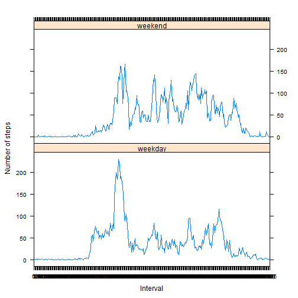

# Reproducible Research: Peer Assessment 1

========================================================

## LOADING AND PREPROCESSING THE DATA:

The data set is loaded into R using the read.csv function.
The class of the variable 'interval' is changed to Factor and the 
class of the variable 'date' is changed to Date.


```r
  mydata <- read.csv("~/activity.csv", header=TRUE)
  mydata$interval <- as.factor(mydata$interval)
  mydata$date <- as.Date(mydata$date)
```


```r
  str(mydata)
```

```
## 'data.frame':	17568 obs. of  3 variables:
##  $ steps   : int  NA NA NA NA NA NA NA NA NA NA ...
##  $ date    : Date, format: "2012-10-01" "2012-10-01" ...
##  $ interval: Factor w/ 288 levels "0","5","10","15",..: 1 2 3 4 5 6 7 8 9 10 ...
```
  

```r
  head(mydata)
```

```
##   steps       date interval
## 1    NA 2012-10-01        0
## 2    NA 2012-10-01        5
## 3    NA 2012-10-01       10
## 4    NA 2012-10-01       15
## 5    NA 2012-10-01       20
## 6    NA 2012-10-01       25
```
  

--------------------------------------------------------

## DETERMINING THE MEAN AND TOTAL STEPS PER DAY:

Calculate the total number of steps taken EACH day (ignore the 
missing values in the data set).  Then plot a histogram of the 
total number of steps taken EACH day.


```r
  TotalStepsPerDay <- aggregate(steps ~ date, mydata, sum, na.action=na.omit)
  hist(TotalStepsPerDay$steps, main="Total Number of Steps Taken Each Day",
          xlab="Number of Steps")
```

 

Calculate and report the mean and median number of steps taken PER day.


```r
meanTotalStepsPerDay <- mean(TotalStepsPerDay$steps, na.rm=TRUE)
medianTotalStepsPerDay <- median(TotalStepsPerDay$steps, na.rm=TRUE)
```

The mean total number of steps per day is: 

```r
meanTotalStepsPerDay 
```

```
## [1] 10766
```

The median total number of steps per day is: 

```r
medianTotalStepsPerDay 
```

```
## [1] 10765
```


--------------------------------------------------------

## DETERMINING THE AVERAGE DAILY ACTIVITY PATTERN:

Calculate and plot the mean total number of steps taken per interval,
averaged across all days (ignore the missing values in the data set).  


```r
  meanStepsPerInterval <- aggregate(steps ~ interval, mydata, mean,
          na.action=na.omit)

  plot(meanStepsPerInterval, type="l",
          main="Mean Number of Steps Taken per Interval")
```

 


```r
  maxStepsPerInterval <- max(meanStepsPerInterval$steps, na.rm=TRUE)

  maxStepsPerInterval.idx <- which(meanStepsPerInterval$steps == 
           maxStepsPerInterval)
  
  maxInterval <- as.character(meanStepsPerInterval[maxStepsPerInterval.idx, 1])
```

The 5-minute interval, on average across all the days in the dataset, that contains the maximum number of steps is:

```r
maxInterval
```

```
## [1] "835"
```


--------------------------------------------------------

## IMPUTE MISSING VALUES:

Merge the data frame with the mean total number of steps taken per 
interval, averaged across all days...  now there is a fourth variable 
in the data frame which will be removed. Then sort the dataframe to
be in the same order as the original. Rename the column of imputed
data to match the original.


```r
  mydata2 <- merge(mydata, meanStepsPerInterval, by="interval")

  na.idx = which(is.na(mydata2$steps.x))

  mydata2[na.idx, 2] <- mydata2[na.idx,4]

  mydata2$steps.y <- NULL

  mydata2 <- mydata2[order(mydata2$date, mydata2$interval),]

  names(mydata2)[2] <- "steps"
```

Calculate and plot the mean total number of steps taken per interval, averaged
across all days (AFTER imputing the missing values).


```r
  imputedTotalStepsPerDay <- aggregate(steps ~ date, mydata2, sum, na.action=na.omit)

  hist(imputedTotalStepsPerDay$steps, main="Total Number of Steps Taken Each Day",
          xlab="Number of Steps")
```

 

Calculate and report the mean and median number of steps taken PER day (AFTER imputing the missing values).


```r
  imputedmeanTotalStepsPerDay <- mean(imputedTotalStepsPerDay$steps, na.rm=TRUE)

  imputedmedianTotalStepsPerDay <- median(imputedTotalStepsPerDay$steps, na.rm=TRUE)
```


The mean total number of steps per day is (AFTER imputing the missing values): 

```r
imputedmeanTotalStepsPerDay 
```

```
## [1] 10766
```

The median total number of steps per day is (AFTER imputing the missing values): 

```r
imputedmedianTotalStepsPerDay 
```

```
## [1] 10766
```
--------------------------------------------------------

## DETERMINE IF THERE ARE DIFFERENCES IN THE ACTIVITY PATTERNS BETWEEN WEEKDAYS AND WEEKENDS:

Recode the date variable from the specific date to either 'weekday' or 'weekend' using the "recode" function from the "car" package.


```r
  w <- weekdays(as.Date(mydata2$date))

  library(car)
  w1 <- recode(w, "c('Saturday', 'Sunday') = 'weekend' ; else = 'weekday' ")

  mydata2 <- cbind(mydata2, w1)
```

Calculate the mean steps per Interval on the weekdays.


```r
  meanStepsPerDayCodeInterval <- aggregate(mydata2$steps,
          by=list(mydata2$interval, w1), FUN=mean)

  names(meanStepsPerDayCodeInterval)[1] <- "interval"
  names(meanStepsPerDayCodeInterval)[2] <- "DayCode"
  names(meanStepsPerDayCodeInterval)[3] <- "steps"
```

Create a multi-panel plot using the lattice plotting package.


```r
  library(lattice)

  xyplot(meanStepsPerDayCodeInterval$steps ~ meanStepsPerDayCodeInterval$interval
       | meanStepsPerDayCodeInterval$DayCode, layout = c(1,2), type="l",
       xlab="Interval", ylab="Number of steps")
```

 

